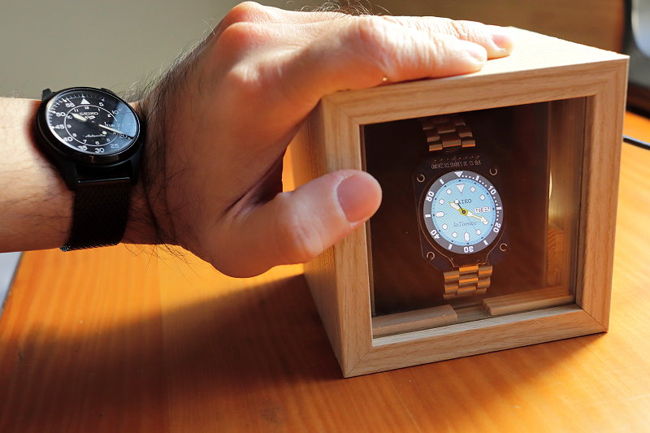
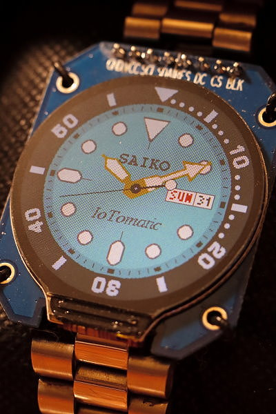

# "Saiko" IoTomatic Watch with ESP32 and Round LCD

"Saiko(u)" (**さいこう**) is an ESP32-based NTP clock drawing a watch dial by code on a GC9A01A round TFT LCD (240x240 pixels).

The analog dial design is based on/inspired by a **Seiko 5 Sports SRPK33K1** diver watch, with the second hand moves 6 times a second as in the 4R36 mechanical movement. The dates do not rotate like the real 4R36 though.

You can read more about the design on [my Hackster.io project page](https://www.hackster.io/alankrantas/saiko-iotomatic-watch-d619e5).

## Wiring

| ESP32 | GC9A01A |
| --- | --- |
| GND | GND |
| 3.3V | VCC |
| 18 (SCK) | SCL |
| 23 (MOSI) | SDA |
| 22 | RES (RST) |
| 21 | DC |
| 5 | CS |
| 3.3V | BLK (backlight) |

## Libraries

- [Arduino NTPClient](https://github.com/arduino-libraries/NTPClient)
- [Adafruit GFX Library](https://github.com/adafruit/Adafruit-GFX-Library)
- [Adafruit GC9A01A Library](https://github.com/adafruit/Adafruit_GC9A01A)

> Note: The clock will try to update time from the NTP server every 30 minutes.
>
> However, the `NTPClient` may cause several-second blocking delays (which cause the watch temporarily stopped moving) due to internet or NTP issues. There are currently no good way around this but to change a better NTP server and/or a better WiFi environment depending on where you are.

## Clock Setup

- Change the `SECRET_SSID` and `SECRET_PASS` to your WiFi ssid/password in `secret.h`.
- Modify `NTP_SERVER` and `NTP_HOUR_OFFSET` to a setting you perfer.
- If `DEMO_MODE` is set to `true`, the watch will display a fixed time (`10:31:42 SUN 31th`) without connnecting to WiFi.
- If `BENCHMARK` is set to `true`, it will calculate and print the time needed to draw the watch dial.

### Advanced

- Most specs and color on the dial can actually be adjusted, for example:
  - `LOGO_NAME` is the name shown on the top half of watch, and `DESCRIPTION` is the smaller text on the lower half.
  - `SECOND_HAND_VIBRATION` defines the vibration of the second hand (6 = 3 Hz).
- The parts of the hour and minute hands are identified by alphabet codes:

